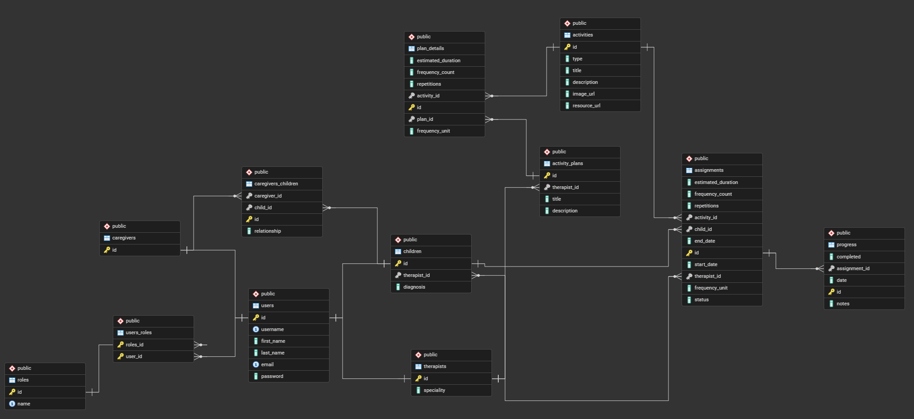

# EnfoKids - API

REST API para la gestión de actividades terapéuticas para niños con TDAH. Permite administrar la relación entre terapeutas, cuidadores y niños, así como planes de actividades y seguimiento de progreso.

## Stack tecnológico

- **Java 21** + **Spring Boot 3.5.7**
- **PostgreSQL** — base de datos relacional
- **Spring Security** + **JWT** — autenticación y autorización
- **Spring Data JPA** + **Hibernate** — acceso a datos
- **MapStruct** — mapeo entidad ↔ DTO
- **Lombok** — reducción de boilerplate
- **SpringDoc OpenAPI** — documentación Swagger en `/docs.html`

## Estructura de carpetas

```
enfokids-api/
├── .env                          # Variables de entorno (credenciales DB, JWT). No subir al repo.
├── .env.example                  # Plantilla de ejemplo para configurar el .env
├── pom.xml                       # Configuración Maven y dependencias
└── src/
    └── main/
        ├── resources/
        │   └── application.properties    # Configuración de la app (BD, JPA, JWT, Swagger)
        └── java/com/github/cawtoz/enfokids/
            │
            ├── EnfoKidsApplication.java  # Punto de entrada de Spring Boot
            │
            ├── config/
            │   └── DataInitializer.java  # Carga datos de prueba al iniciar (roles, usuarios, actividades, planes)
            │
            ├── model/                    # Entidades JPA (dominio de la aplicación)
            │   ├── user/
            │   │   ├── User.java         # Entidad base de usuario (herencia JOINED)
            │   │   └── types/
            │   │       ├── Therapist.java    # Terapeuta: tiene especialidad y lista de niños asignados
            │   │       ├── Child.java        # Niño/paciente: tiene diagnóstico, terapeuta y cuidadores
            │   │       └── Caregiver.java    # Cuidador/padre: vinculado a uno o varios niños
            │   ├── role/
            │   │   ├── Role.java             # Entidad de rol (ADMIN, THERAPIST, CAREGIVER, CHILD, USER)
            │   │   └── RoleEnum.java         # Enumeración de roles disponibles
            │   ├── activity/
            │   │   ├── Activity.java         # Actividad terapéutica (título, descripción, tipo, URLs)
            │   │   ├── ActivityPlan.java     # Plan de actividades creado por un terapeuta
            │   │   ├── PlanDetail.java       # Vincula una actividad a un plan con frecuencia y duración
            │   │   ├── Assignment.java       # Tarea asignada a un niño por un terapeuta
            │   │   ├── Progress.java         # Registro de progreso de una tarea (completado, notas, fecha)
            │   │   └── enums/
            │   │       ├── ActivityTypeEnum.java       # DIGITAL / NON_DIGITAL
            │   │       ├── FrequencyUnitEnum.java      # DAY / WEEK / MONTH
            │   │       └── AssignmentStatusEnum.java   # PENDING / IN_PROGRESS / COMPLETED
            │   └── relation/
            │       └── CaregiverChild.java   # Relación muchos-a-muchos entre cuidador y niño (con tipo de vínculo)
            │
            ├── dto/                      # Objetos de transferencia de datos (no expone entidades directamente)
            │   ├── ErrorResponse.java    # Estructura estándar para respuestas de error
            │   ├── request/              # DTOs de entrada: LoginRequest, UserRequest, ChildRequest, etc.
            │   └── response/             # DTOs de salida: LoginResponse (con JWT), UserResponse, ChildResponse, etc.
            │
            ├── mapper/                   # Conversores entidad ↔ DTO usando MapStruct
            │   └── (UserMapper, ChildMapper, ActivityMapper, etc.)
            │
            ├── repository/              # Interfaces Spring Data JPA para acceso a la BD
            │   └── (UserRepository, ChildRepository, ActivityRepository, etc.)
            │
            ├── service/                 # Lógica de negocio
            │   ├── AuthService.java     # Autenticación: valida credenciales y genera el JWT
            │   └── (UserService, ChildService, ActivityService, etc.)
            │
            ├── controller/              # Controladores REST — exponen los endpoints de la API
            │   ├── AuthController.java          # POST /api/auth/login, GET /api/auth/me
            │   ├── UserController.java          # CRUD /api/users, GET /api/users/email/{email}
            │   ├── ChildController.java         # CRUD /api/children, filtro por terapeuta
            │   ├── TherapistController.java     # CRUD /api/therapists
            │   ├── CaregiverController.java     # CRUD /api/caregivers
            │   ├── RoleController.java          # CRUD /api/roles
            │   ├── ActivityController.java      # CRUD /api/activities
            │   ├── ActivityPlanController.java  # CRUD /api/activity-plans
            │   ├── PlanDetailController.java    # CRUD /api/plan-details
            │   ├── AssignmentController.java    # CRUD /api/assignments
            │   ├── ProgressController.java      # CRUD /api/progress
            │   └── CaregiverChildController.java # CRUD /api/caregiver-children
            │
            ├── security/                # Configuración de seguridad y JWT
            │   ├── SecurityConfig.java              # Reglas de acceso, CORS, filtros de Spring Security
            │   ├── JwtUtil.java                     # Genera y valida tokens JWT
            │   ├── JwtAuthFilter.java               # Intercepta requests y valida el token en cada llamada
            │   ├── CustomUserDetailsService.java    # Carga usuario desde BD para Spring Security
            │   ├── JsonAuthenticationEntryPoint.java # Respuesta JSON para errores 401
            │   └── JsonAccessDeniedHandler.java     # Respuesta JSON para errores 403
            │
            ├── exception/               # Excepciones personalizadas y manejo global
            │   ├── GlobalExceptionHandler.java      # @RestControllerAdvice — convierte excepciones en respuestas HTTP
            │   ├── ResourceNotFoundException.java   # 404: recurso no encontrado
            │   ├── UnauthorizedException.java       # 401: no autenticado
            │   └── ForbiddenException.java          # 403: sin permisos
            │
            ├── validation/              # Validaciones personalizadas con anotaciones
            │   ├── UniqueEmail.java / UniqueEmailValidator.java       # Verifica que el email no esté en uso
            │   └── UniqueUsername.java / UniqueUsernameValidator.java # Verifica que el username no esté en uso
            │
            └── generic/                 # Clases base reutilizables para CRUD genérico
                ├── GenericController.java  # Controlador abstracto con GET, POST, PUT, DELETE base
                ├── GenericService.java     # Servicio abstracto con lógica CRUD base
                ├── GenericMapper.java      # Interfaz base para mappers MapStruct
                └── GenericEntity.java      # Interfaz base para entidades con ID
```

## Base de datos

### Estrategia de herencia: JOINED

Los usuarios se modelan con herencia JOINED en JPA. Esto significa que existe una tabla base `users` con los campos comunes, y tablas separadas para cada tipo de usuario (`therapists`, `children`, `caregivers`) que se unen mediante un JOIN cuando se necesitan los datos completos.

```
users (tabla base)
├── id, username, password, email, firstName, lastName
├── therapists  → speciality
├── children    → diagnosis, therapist_id
└── caregivers  → (sin campos extra, solo el JOIN)
```

### Tablas y relaciones


### Descripcion de cada tabla

| Tabla | Descripcion |
|-------|-------------|
| `users` | Datos base de todos los usuarios del sistema |
| `therapists` | Extiende `users` — almacena la especialidad del terapeuta |
| `children` | Extiende `users` — almacena el diagnóstico y el terapeuta asignado |
| `caregivers` | Extiende `users` — no tiene campos extra, solo el JOIN base |
| `roles` | Catalogo de roles: ADMIN, THERAPIST, CAREGIVER, CHILD, USER |
| `user_roles` | Relacion many-to-many entre usuarios y roles |
| `caregiver_children` | Vincula cuidadores con niños e indica el tipo de relacion (madre, padre, tio, etc.) |
| `activities` | Catalogo de actividades terapéuticas reutilizables |
| `activity_plans` | Plan de actividades creado por un terapeuta, compuesto por varias actividades |
| `plan_details` | Detalle de cada actividad dentro de un plan: frecuencia, repeticiones y duración estimada |
| `assignments` | Asignacion concreta de una actividad a un niño por un terapeuta, con fechas y estado |
| `progress` | Registro de cada vez que el niño realiza (o intenta) una asignacion |

### Relaciones clave

**Usuarios y roles**
- Un usuario puede tener varios roles (many-to-many via `user_roles`).
- Los roles determinan que puede hacer cada usuario en la API.

**Terapeuta → Niño**
- Un terapeuta tiene muchos niños asignados (one-to-many).
- Cada niño pertenece a exactamente un terapeuta.

**Cuidador → Niño**
- La relacion es many-to-many con informacion extra (el tipo de vinculo: madre, padre, abuelo, etc.).
- Se gestiona mediante la tabla `caregiver_children`.
- Un cuidador puede estar vinculado a varios niños y un niño puede tener varios cuidadores.

**Actividades y planes**
- Una `Activity` es una plantilla reutilizable (ej. "Juego de memoria").
- Un `ActivityPlan` es un plan creado por un terapeuta que agrupa actividades.
- `PlanDetail` es la tabla intermedia que vincula una actividad a un plan y agrega configuracion (frecuencia, duración, repeticiones).
- Al eliminar un plan, sus `PlanDetail` se eliminan en cascada.

**Asignaciones y progreso**
- Una `Assignment` es cuando un terapeuta asigna una actividad específica a un niño, con fechas y frecuencia.
- Tiene un estado: `PENDING` → `IN_PROGRESS` → `COMPLETED`.
- Cada vez que el niño realiza esa tarea se crea un registro `Progress` con notas, fecha y si la completó o no.

### Flujo tipico de uso

```
1. El terapeuta crea actividades en el catálogo
         ↓
2. El terapeuta arma un ActivityPlan con varias actividades (PlanDetails)
         ↓
3. El terapeuta asigna actividades directamente a un niño (Assignments)
         ↓
4. El niño o cuidador registra el progreso de cada tarea (Progress)
         ↓
5. El terapeuta puede consultar el historial de progreso del niño
```

### Flujo de autenticacion

```
1. Cliente envía POST /api/auth/login con { email, password }
         ↓
2. AuthService valida credenciales contra la BD
         ↓
3. Si son correctas, JwtUtil genera un token JWT firmado con el username y roles
         ↓
4. El cliente recibe el token y lo incluye en cada request: Authorization: Bearer <token>
         ↓
5. JwtAuthFilter intercepta la request, extrae y valida el token
         ↓
6. Spring Security carga el usuario y verifica sus permisos antes de llegar al Controller
```

## Flujo general

```
Request → JwtAuthFilter → SecurityConfig → Controller → Service → Repository → BD
                                                     ↕                ↕
                                                   Mapper           Entity
                                                     ↕
                                                   DTO → Response
```

## Endpoints principales

| Método | Endpoint | Descripción |
|--------|----------|-------------|
| POST | `/api/auth/login` | Login — devuelve JWT |
| GET | `/api/auth/me` | Usuario autenticado actual |
| GET/POST | `/api/users` | Listar / crear usuarios |
| GET/PUT/DELETE | `/api/users/{id}` | Obtener / actualizar / eliminar |
| GET | `/api/users/email/{email}` | Buscar por email |
| GET/POST | `/api/children` | Listar / crear niños |
| GET | `/api/children?therapistId={id}` | Niños por terapeuta |
| GET/POST | `/api/therapists` | Listar / crear terapeutas |
| GET/POST | `/api/caregivers` | Listar / crear cuidadores |
| GET/POST | `/api/activities` | Listar / crear actividades |
| GET/POST | `/api/activity-plans` | Listar / crear planes |
| GET/POST | `/api/assignments` | Listar / crear asignaciones |
| GET/POST | `/api/progress` | Listar / crear registros de progreso |

Documentacion interactiva disponible en `/docs.html` (Swagger UI).

## Configuracion

Crea un archivo `.env` en la raiz basandote en `.env.example`:

```env
DATABASE_URL=jdbc:postgresql://localhost:5432/enfokids
DATABASE_USERNAME=postgres
DATABASE_PASSWORD=tu_password
JWT_SECRET_KEY=tu_clave_secreta_base64
JWT_EXPIRATION_TIME=86400000
```

> La aplicacion usa `spring.jpa.hibernate.ddl-auto=create-drop`, por lo que **recrea la BD en cada arranque**. Util para desarrollo, cambiar en produccion.
